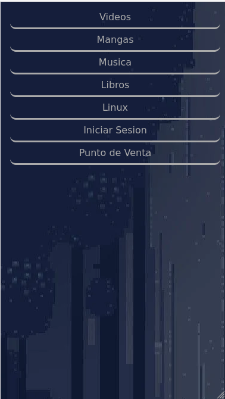
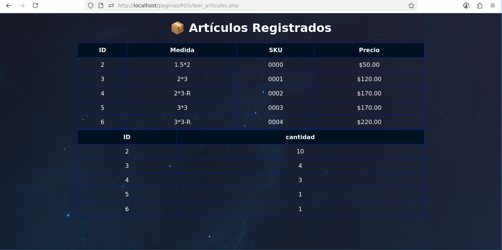
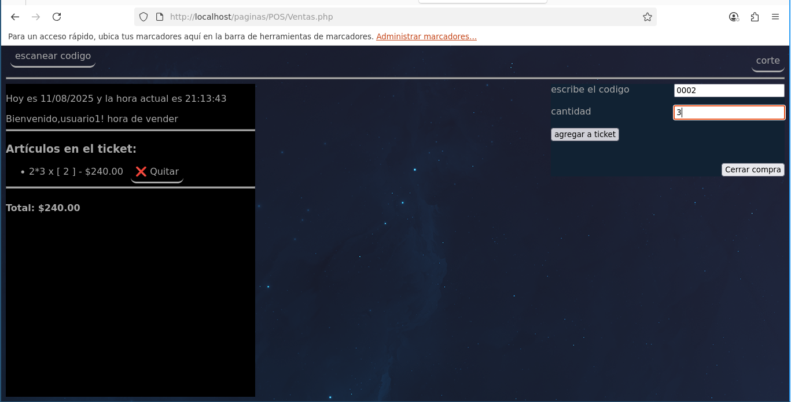

# La Caverna Del Nigromante
 
**Descripcion**

*Este Proyecto es solo con fines de desarrollar habilidades de diseño de sitios web asi como crear un servidor personal,el cual servira para almacenar para cualquer contenido multimedia ,las funciones que tendra seran las siguientes :*

* Visualizar Anime
* Visualizar Video
* Visualizar Libros
* Visualizar Mangas
* Reproducir Musica
* Guardar tus archivos (Desde otros dispositivos)
* Blog para documentar conocimientos varios
* Crear un CCV personalizado(Circuito Cerrado)
* Crear un POS personalizado(Punto de venta)

**Tecnologias Utilizadas**

- Apache2
- Php
- Sqlite3
- Html
- Css
- Javascript
- Bash
- Ffmpeg

**Sistema operativo (linux)**

**Instalacion**

*Para la instalacion y configuracion de este proyecto he dejado un script en bash que facilita la instalacion.
ver el contenido de la carpeta Scripts.*

**Uso despues de la instalacion**

1.- ejecutar el comando para que se inicie la grabacion de los fragmentos .ts para ser transmitidos por apache

´ffmpeg -f v4l2 -i /dev/video0 \-preset ultrafast \-vcodec libx264 \-acodec aac \-f hls \-hls_time 3 \-hls_list_size 6 \-hls_segment_filename "/var/www/html/stream/video-stream%3d.ts" \/var/www/html/stream/video-stream.m3u8
´

* sustituye /dev/video0 por el numero correspondiente a tu dispositivo
* sustituye "/var/www/html/stream/video-stream%3d.ts" \/var/www/html/stream/video-stream.m3u8 por la ruta donde se guardaran los fragmentos.

2.- ingresa a localhost para visualizar el archivo index.html

**Licencia**

**Dependencias**

**Capturas de pantalla**

**Punto de Venta**

**Hoja de ruta**

**Autor**
- Jose francisco (Desarrollador Principal)
- Jose francisco (Diseñador UI)
